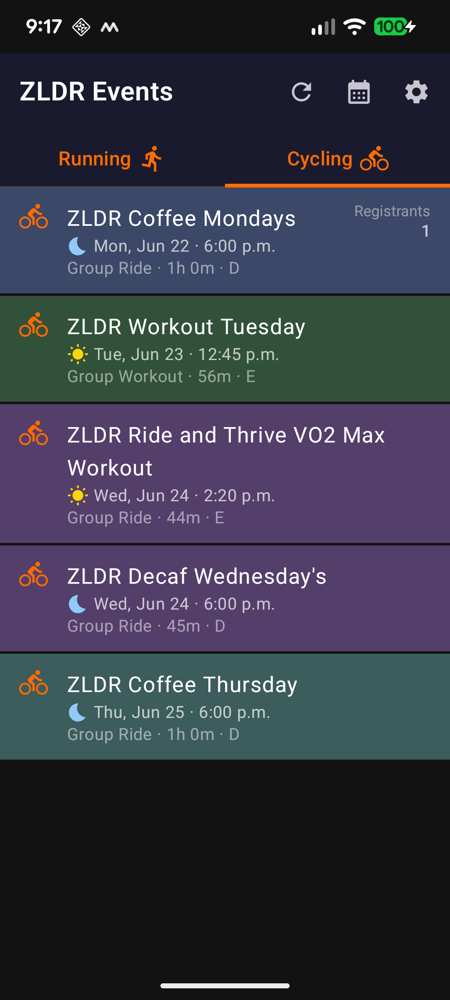
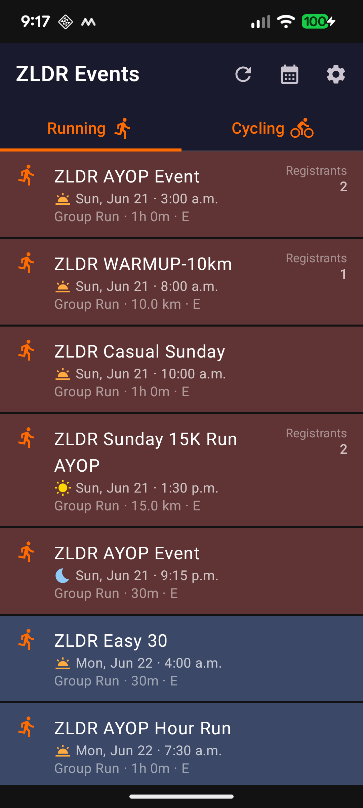
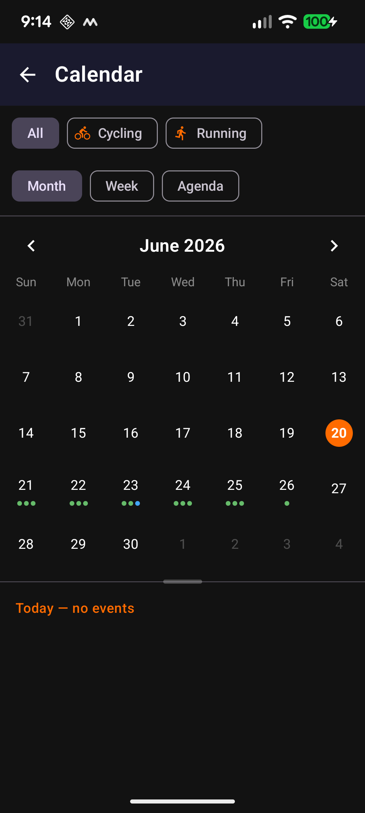
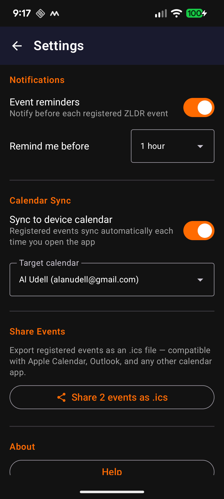

# ZLDR Events

An Android and PWA web app for the ZLDR (Zwift Long Distance Runners and Riders) community that displays all upcoming ZLDR cycling and running events directly from Zwift, and provides links to easily join events.

## Features

An Android and PWA web app for the ZLDR (Zwift Long Distance Runners and Riders) community that displays all upcoming ZLDR cycling and running events directly from Zwift, and provides links to easily join events.

- **Cycling & Running tabs** — events are split by sport so you can focus on what matters to you.
- **Registered event highlighting** — events you're signed up for are highlighted in gold across the event list and Calendar.
- **Calendar view** — browse events in Month, Week, or Agenda layout with a resizable event panel.
- **Event reminders** — local notifications before each event you're registered for, with a customisable lead time.
- **Calendar sync** — automatically adds your registered events to your device calendar each time the app opens.
- **Share as .ics** — export your registered events to any calendar app that supports iCalendar.
- **Event detail view** — tap any event to see the complete information: route name, distance, elevation, category breakdown, and how many riders or runners have signed up.
- **Always up to date** — pull the latest events any time with the refresh button. The app queries Zwift directly, so you're always seeing real data, not a cached snapshot.
- **Secure sign-in** — your Zwift credentials are used only to obtain a session token, which is stored locally on your device and wiped the moment you sign out.

  
  &nbsp;
  
  &nbsp;
  
  &nbsp;
  

---

## Web App (PWA)

A Progressive Web App version is available at **https://zldr-events.fly.dev** — no download or installation required. It works on any device with a modern browser, including:

- iOS (Safari)
- Android (Chrome)
- Windows (Chrome, Edge, or any browser)
- macOS (Safari, Chrome, or any browser)
- Any other platform with a modern browser

### Install on Android (Chrome)

Chrome does not automatically show an install prompt. To add the app to your home screen:

1. Open **https://zldr-events.fly.dev** in Chrome
2. Tap the **⋮** menu (three dots, top right)
3. Tap **"Add to Home screen"**

After installing, the app launches in standalone mode — no browser address bar — from an icon on your home screen, exactly like a native app.

### Install on iOS (Safari)

Safari does not automatically show an install prompt. To add the app to your home screen:

1. Open **https://zldr-events.fly.dev** in Safari
2. Tap the **Share** button (box with arrow, bottom of screen)
3. Tap **"Add to Home Screen"**

After installing, the app launches in standalone mode — no browser address bar — from an icon on your home screen, exactly like a native app.

---

## Android App Download

Go to the [Releases](../../releases) page to download the latest APK.

> **Install note:** You will need to allow installation from unknown sources on your Android device. Go to **Settings → Apps → Special app access → Install unknown apps** and enable it for your browser or file manager.

## User Guide

- [User Guide (HTML)](https://victorypoint.github.io/ZLDREvents/docs/userguide.html)
- [User Guide (PDF)](docs/userguide.pdf)

## Requirements

**Web app:** Any modern browser (Chrome, Safari, Edge, Firefox). A Zwift account.

**Android app:** Android 8.0 (Oreo) or higher. A Zwift account.
