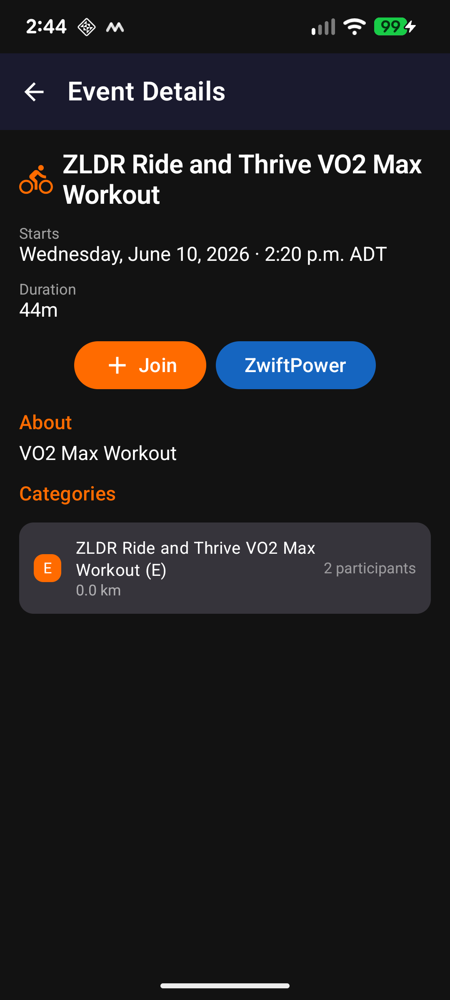

# ZLDR Events

An Android app for the ZLDR (Zwift Long Distance Runners and Riders) community that displays all upcoming ZLDR cycling and running events directly from Zwift, and provides links to easily join events.

## Features

**ZLDR Events** is the simplest way to keep up with every upcoming ZLDR ride and run. Sign in once with your Zwift account and the app does the rest — automatically discovering all ZLDR events from Zwift and presenting them in a clean, easy-to-browse list.

- **Cycling & Running tabs** — events are split by sport so you can focus on what matters to you. Tap any event to see the full details: route, duration, distance, subgroups, and sign-up count.
- **Always up to date** — pull the latest events any time with the refresh button. The app queries Zwift directly, so you're always seeing real data, not a cached snapshot.
- **Event detail view** — tap any event to see the complete information: route name, distance, elevation, category breakdown, and how many riders or runners have signed up.
- **Secure sign-in** — your Zwift password is never stored. Only the session tokens are saved, encrypted with AES-256-GCM, and wiped the moment you sign out.

  
  &nbsp;
  
  &nbsp;
  
  &nbsp;
  

---

## Download

Go to the [Releases](../../releases) page to download the latest APK.

> **Install note:** You will need to allow installation from unknown sources on your Android device. Go to **Settings → Apps → Special app access → Install unknown apps** and enable it for your browser or file manager.

## User Guide

- [User Guide (HTML)](https://victorypoint.github.io/ZLDREvents/docs/userguide.html)
- [User Guide (PDF)](docs/userguide.pdf)

## Requirements

- Android 8.0 (Oreo) or higher
- A Zwift account
